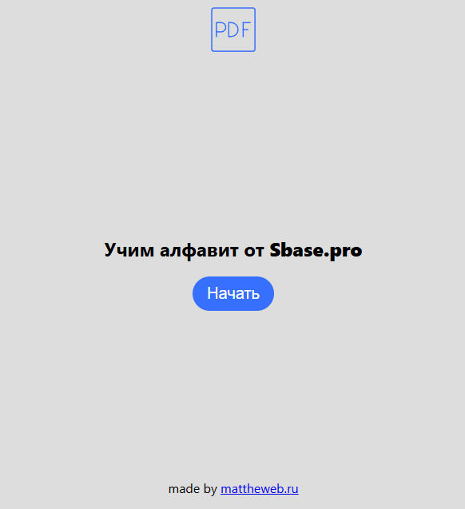
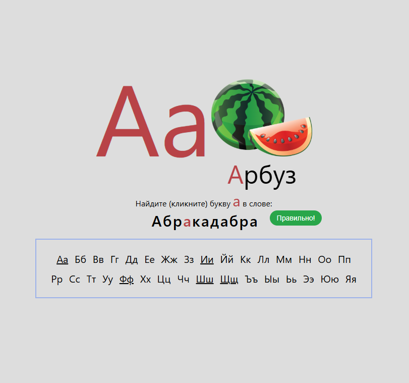

## Веб-приложение "Сервис по изучению алфавита" 🚀

**Мини-приложение "Сервис по изучению алфавита"**  
Описание задания:  
Цель: Разработать SPA-приложение для изучения алфавита с интерактивными упражнениями.

Основные требования:
- Главная страница (/)
- Кнопка "Начать" для перехода к обучению
- Страница обучения (/challenge/:letter)
- Блок буквы - отображение текущей буквы с картинкой
- Блок задания - слово с поиском буквы + проверка ответов
- Блок алфавита - навигация по буквам с выделением активной

## 🛠️ Cтек
    angular/core: 19.2.0
    typescript: 5.7.2
    CSS 3
    HTML 5
    Intellij IDEA v.2024.3

## 💡 Инструкция по запуску приложения
Для корректной работы и запуска данного Angular 19 приложения выполните следующие шаги:

### 1. Требования к окружению
- **IDE с поддержкой локального сервера**  
  Рекомендуется использовать современную IDE, например **IntelliJ IDEA**, которая поддерживает запуск локального сервера и интеграцию с Node.js.
- **Node.js**  
  Необходима установленная версия Node.js одной из версий:
  - ^18.19.1
  - ^20.11.1
  - ^22.0.0

### 2. Установка зависимостей

1. Откройте проект в вашей IDE.
2. Откройте терминал в корневой директории приложения.
3. Выполните команду для установки зависимостей:
   ```bash
   npm ci
   ```
### 3. Запуск приложения
Для запуска приложения используйте вашу IDE.   
В IntelliJ IDEA используйте сочетание клавиш Shift + F10 для запуска локального сервера. Либо выполните команду в терминале с помощью Angular CLI:
   ```bash
    ng serve
   ```
### 4. Примечание
После запуска приложение будет доступно по адресу:
http://localhost:4200.

### 5. Общий вид ПО
<div align="center">
   
    <h4>Стартовая страница</h4>
</div>
<div align="center">
   
    <h4>Страница с заданием</h4>
</div>

## 🔗 Ссылки
### Ссылка протестить это ПО (без SSL) : http://abc.mattheweb.ru  
[](https://mattheweb.ru/git-badges-readme-testTask-sbase-pro)  
[](https://t.me/rudalsmolyusr)  
[](https://github.com/Solrud)
